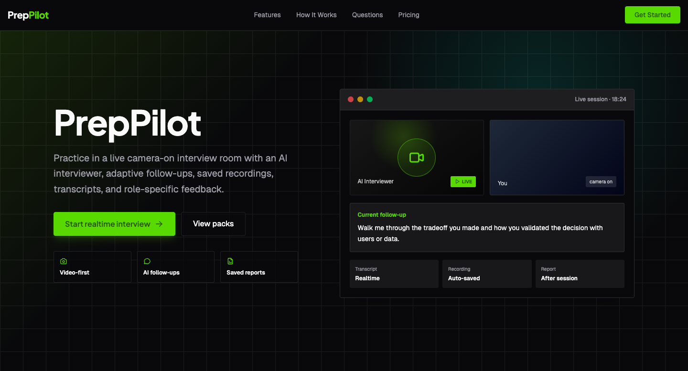
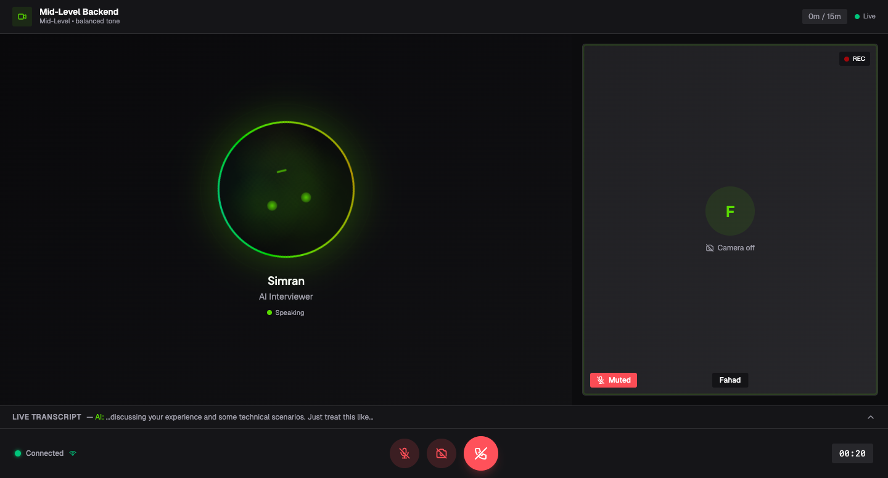

  

Interview preparation, built around the way you want to be hired.

  
  
  

  

## Purpose

PrepPilot helps candidates turn interview preparation into deliberate practice. It replaces generic question lists and unstructured rehearsal with tailored interview sessions, immediate feedback, and a clear view of what to improve next.

The product is designed for people preparing for high-stakes career conversations: individual candidates refining their approach, career teams supporting talent at scale, and organizations that need a more consistent way to develop interview readiness.

## What PrepPilot solves

Preparing for an interview is often fragmented. Candidates search for questions, practice without pressure, and receive feedback too late—or not at all. PrepPilot brings those moments together in a single experience.

- Practice against the role, seniority, company context, and interview format that matter.
- Rehearse in a live, conversational setting instead of relying on static prompts.
- Build confidence answering behavioral, technical, domain, leadership, and situational questions.
- Receive structured feedback that makes strengths, gaps, and next actions clear.
- Track progress across sessions rather than treating preparation as a one-off event.

## The PrepPilot experience

### Configure the session

Start with the context of the opportunity: role, interview focus, target company, duration, interviewer style, and voice preference. PrepPilot uses that context to create a practice session that feels relevant—not generic.

### Practice under realistic conditions

Take part in a guided interview designed to keep the conversation moving. Questions can probe beyond the first answer, helping candidates practice the judgment, clarity, and composure that interviews demand.

  

### Review what matters

After each session, PrepPilot turns performance into an actionable review. Candidates can identify where their answers were strongest, where their story lost focus, and what to work on before the next interview.

## Product capabilities

| Capability                  | What it enables                                                                                 |
| --------------------------- | ----------------------------------------------------------------------------------------------- |
| Tailored interview setup    | Practice sessions shaped around role, experience level, interview type, and target opportunity. |
| Live AI interviewer         | A responsive interview format that supports natural spoken practice.                            |
| Adaptive questioning        | Follow-up questions that encourage deeper, more complete answers.                               |
| Interview evaluation        | Feedback across answer quality, structure, relevance, confidence, and depth.                    |
| Session reports             | A consolidated view of strengths, improvement areas, and overall performance.                   |
| Resume-informed preparation | Practice grounded in a candidate’s experience and career direction.                             |
| Team experience             | Shared visibility for organizations supporting cohorts or career-development programs.          |

## Built for meaningful preparation

PrepPilot is intentionally more demanding than a prompt generator. It combines role-specific context, conversation flow, response evaluation, and progress review so preparation can mirror the complexity of a real interview while still giving candidates a focused path forward.

The result is a repeatable practice loop: prepare with context, perform under pressure, review with intent, and return sharper.

## Confidentiality

PrepPilot is proprietary, closed-source software. This repository and its contents are confidential and intended solely for authorized personnel. It is not licensed for public use, redistribution, external contribution, or disclosure.
